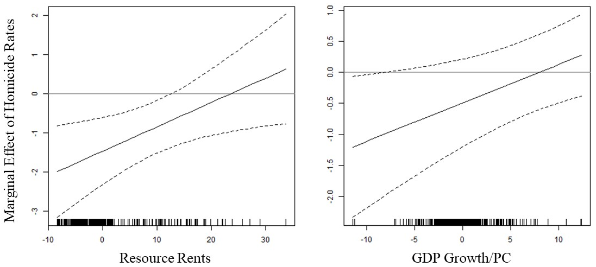
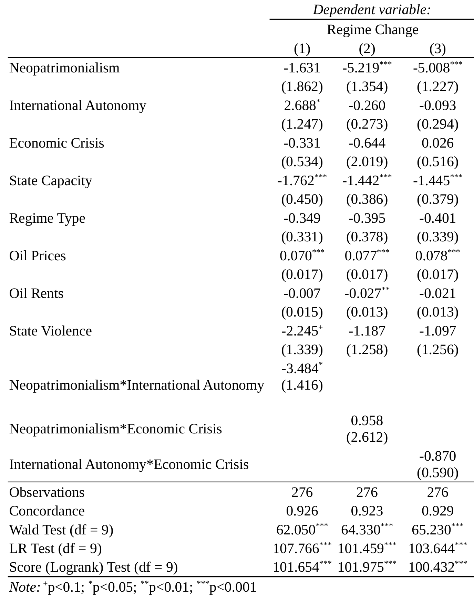
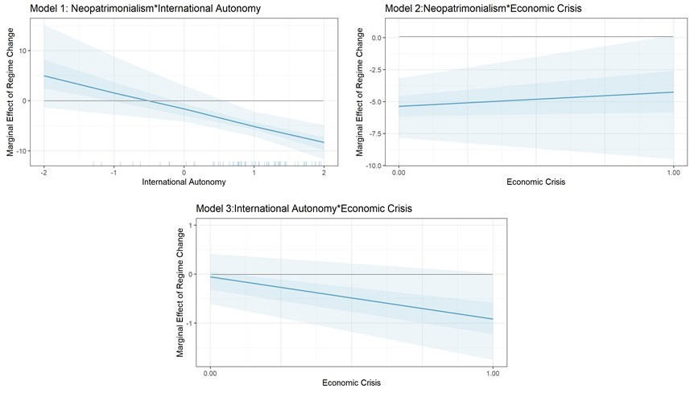

# My data analysis projects at a glance

## About me
Passionate about data analysis, statistics, and international development, I bring a diverse background spanning academia and the United Nations. With a Ph.D. in Global Studies, I specialize in quantitative and qualitative data analysis, international political economy, and capacity-building initiatives.

At the United Nations Economic Commission for Latin America and the Caribbean (UN-ECLAC), I designed and implemented research projects advancing the 2030 Sustainable Development Goals, focusing on socioeconomic and environmental statistics, labour markets, and migration. I also facilitated technical capacity-building workshops and multilateral meetings with Member State representatives. Before that, I published peer-reviewed research on international political economy, migration, and regime stability in academia. Additionally, my freelance work included organizing international conferences, contributing to communications strategies for NGOs, and conducting field research on ecological risks and community knowledge creation.

My international experiences—having lived in Germany, the Caribbean, Venezuela, the United States, and Egypt and witnessing socioeconomic disparities firsthand—have shaped my commitment to global development. Fluent in English, German, and Spanish, and with good knowledge of French and Portuguese, I thrive in multicultural environments and bring high cultural and gender sensitivity to my work.

In this page, I provide vingnettes of some of my recently projects in data analysis and statistics.

##  My data analysis projects with the United Nations

### Labour productivity, education financing and education outcomes in the Caribbean

This ongoing project at UN-ECLAC, based on recent [policy publications](https://repositorio.cepal.org/entities/publication/ae5d0441-f309-4b60-87c8-67aa8aba9969), argues that labour productivity is an important cornerstone of the modern economy and increasing it is essential for countries to maintain economic growth, a crucial factor for achieving several sustainable development goals (SDGs), including eliminating poverty and hunger and promoting decent work (SDGs 1, 2, and 8). Unfortunately, available data show that labour productivity has declined or stagnated in most Caribbean countries in recent years. Arguably, deficiencies in the education system are a factor in the poor labour productivity of the subregion. These deficiencies, such as poor educational attainment and skills mismatch, result in poor quality of output, even as the number of school leavers and graduates increase, ultimately resulting in relatively low human capital, which hinders labour productivity in the Caribbean.

Labour productivity from 2012 to 2022 in 12 Caribbean member States was about four US$ lower than the Small-Islands Developing States' (SIDS) average, as shown in Figure 1. This trendline exhibits a stagnant trend at between 17 and 18 US$ from 2012 to 2019, after which it shows a steep upward slope, reaching 20.26 US$ in 2022. However, removing Guyana from the trendline of average labour productivity, containing 11 Caribbean member States, shows that this indicator stagnated throughout the analysed period at around 17 US$. Guyana is an outlier due to the massive oil windfalls accrued by this country in the late 2010s. As a result, the meteoric rise of its GDP in the recent past increases the indicator of output per hour worked, thus inflating its labour productivity levels.

#### Figure 1: Labour productivity in the Caribbean and SIDS

Source: Economic Commission for Latin America and the Caribbean (ECLAC), on the basis of the International Labour Organization.

The trendline with eight Caribbean member States reveals a downward trend of labour productivity from 2012 to 2022 (Figure 1). This trendline excludes four Caribbeancountries; three countries with substantially larger populations compared to the other Caribbean countries (Cuba, Dominican Republic, and Haiti) and Guyana, an outlier due to extraordinary hydrocarbon windfalls. Average output per hour worked in these eight English- and Dutch-speaking Caribbean member States progressively fell from 19.5 US$ in 2012 to 18.9 US$ in 2019 (Figure 13). The COVID-19 pandemic adversely affected labour productivity, as expected, and output per hour worked further dropped to 17.7 US$ in 2020 and 2021, before recovering to 18.5 US$ in 2022. However, average output per hour worked in 2022 was one dollar less than one decade prior.

Orthodox human capital theory places the skills and knowledge imparted by educational institutions in adults, youth and children as a key driver of human capital (Becker, 993), and thus of labour productivity. The different industrial revolutions exemplify how productivity is driven by a labour force that can innovate complex technologies and effectively work with them to increase economic growth. Hence, education in the Caribbean is vital for economic development, social mobility, and individual empowerment (Wright, 2024). Although education is central to human capital formation, and thus to sustainable economic development, public financing for education in the Caribbean is not always optimal, creating deficiencies in educational outcomes. These deficiencies contribute to mismatches between educational outcomes and labour market needs, which adversely affect economic productivity in the subregion.
   
Educational outcomes are directly related to measures of sustainable development, such as labour productivity. Not surprisingly, the Human Development Index shows high correlation with the learning-adjusted years of school (average years of school weighted for the average harmonized test scores) for 25 SIDS, including 11 Caribbean member States for 2020 (Figure 2). This correlation is statistically significant (P-value < 0.001) and positive (R2 = 0.85), suggesting a strong relationship between education and human development. Yet, students in the subregion face significant challenges that hinder human capital formation and threaten progress on Goal 4 of the Sustainable Development Goals (SDGs), which aims for inclusive and equitable quality education for all. 

#### Figure 2: Correlation of Human Development Index and learning-adjusted years of school in SIDS, 2020

Source: Economic Commission for Latin America and the Caribbean (ECLAC), on the basis of UNDP, World Bank, and UNESCO; figures created with R Statistical Software version 4.3.1 and the ggplot2 package.

The impact of education onlabour productivity in the Caribbean is profound. Due to the importance of education as a key driver of human capital, public investments in education are essential to equip the workforce with the necessary skills, allowing them to contribute to overall productivity through their labour (Becker, 1993). This relationship is depicted in Figure 3, which correlates the average learning-adjusted years of school and government expenditure on education as a proportion of GDP, scaled for the population under 18 years of age in 25 SIDS for 2020. This correlation shows a moderately positively (R2 of 0.49) and statistically significant (P-value < 0.05) relationship between these variables. This relationship suggests that adequate public investments in education are essential for human capital accumulation.

#### Figure 3: Correlation of Learning-Adjusted Years of School and government expenditures on education to GDP (%) in SIDS, 2020, scaled for population under 18 years old

Source: Economic Commission for Latin America and the Caribbean (ECLAC), on the basis of UNDP, World Bank, and UNESCO; figures created with R Statistical Software version 4.3.1 and the ggplot2 package.

##  My data analysis projects in academia

### How natural resource exports moderate business cycles’ relationship to high homicide rates

In a [research article published in 2023 in the journal Global Crime](https://doi.org/10.1080/17440572.2022.2138859), I explore the relationships between macroeconomic conditions and how the forms of integration into the global economy affect homicide rates in 21 high-violence countries from 2000 to 2018. The analysis focuses on countries integrated into the global economy by accruing international economic rents. I use data from 2000 to 2018 to analyze how resource rents and remittances moderated the relationship between business cycles and high homicide rates. In this vignette, however, I focus solely resource rents, meaning exceedingly high income accrued by governments from natural resource exports. The results indicate that natural resource rents conditioned a procyclical relationship between business cycles and homicide rates. The findings contribute to the rich and growing economic criminology and international political economy literature investigating how international rents condition subnational violence. 

#### Table 1: The mediated moderation model of homicide rates by resource rents

Source: [Leon, 2023](https://doi.org/10.1080/17440572.2022.2138859), I estimated the panel regression models through the statistical software R, version 4.1.2, and using the panel econometrics package and formatted the regression tables through the stargazer package.

Table 1 shows the results of the moderated mediation model with resource rents as the conditioning variable. Model 1 depicts an overall moderating effect, as the interaction term between the predictor (GDP growth per capita) and moderating variable (the misery index, the sum of annual inflation and unemployment rates) are statistically significant and exhibit the expected positive sign. Notably, GDP growth per capita is negative and statistically significant, thus showing a countercyclical relationship to homicide rates, as theoretically expected. Furthermore, Model 2 shows a statistically significant relationship between the predictor and the outcome variable. Hence, the first two models’ results confirm the statistical assumptions to estimate the complete moderated mediation model depicted in Model 3. The entire model’s results show that the mediating variable is statistically significant and positive. Importantly, these results meet the theoretical expectation that the overall process passes through the misery index, even if the interaction term between the moderator and mediator was statistically insignificant. Model 3 also shows that the effect size of the predictor variable decreased from approximately -1.71 to -1.47, further indicating that the moderated mediation effect is partial but present. Crucially, the interaction term between the predictor and moderating variable remains significant and positive in model 3. Hence, there is evidence that resource rents procyclically moderated the indirect effect between business cycles and homicide rates.

#### Figure 4: Marginal effect of resource rents on GDP growth per capita

Source: [Leon, 2023](https://doi.org/10.1080/17440572.2022.2138859), I plotted all marginal effects of analysed international terms using the statistical software R, version 4.1.2, and using the ‘DAMisc’ package developed by Dave Armstrong.

Illustrating the interaction term between GDP growth per capita and resource rents, estimated in Model 3, helps interpret the results properly. Figure 4 shows that a unit increase in resource rents or yearly GDP per capita reverses the countercyclical relationship between business cycles and homicide rates. In other words, marginal increases in resource rents interact to make the relationship between business cycles and homicide rates procyclical. The 95 percent confidence interval of the left-hand plot departs from zero, except in the higher levels of rent accruement due to resource rent’s low number of observations at its higher values. However, the right-hand plot’s 95 percent confidence interval does not depart from zero after the minus five value of GDP growth per capita, likely due to the low number of observations.

The results of resource rents’ moderating effect provide sufficient evidence to partially confirm the hypothesis that increased resource rents overtime condition increased homicide rates during upward business cycles while accounting for the intervening role of socioeconomic conditions. Hence, resource rents moderated increased violence rates procyclically to overall productivity. The confirmation of this hypothesis is only partial because the confidence intervals of the plots in Figure 4 do not entirely depart from zero. However, the plots show steep upward slopes, suggesting that one-unit marginal increases in the interaction between the predictor and moderator variables lead to one- to two-point increases in the outcome variable of homicide rates. In other words, these results suggest but do not fully confirm a procyclical moderation effect by direct international rents on the studied countries’ business cycles, which leads to increased homicide rates. 

### How weak authoritarian petrostates survive economic crises

Most scholarship on major oil-producing countries (OPCs) focuses on their illiberal characteristics, but scant research explores how these regimes react to periodic oil price collapses, particularly neo-patrimonial OPCs with relatively low state capacity. These OPCs should be extremely vulnerable to regime change during economic crises. However, since the most recent collapse in international oil markets in 2014, almost all neo-patrimonial OPCs have managed to weather the ensuing fallout, thereby begging the question of how these seemingly vulnerable regimes manage to survive extended periods of economic crises. In a research paper published in [2022 in the Journal of International Relations and Development](https://doi.org/10.1057/s41268-022-00271-1), my colleague Charles Larratt-Smith and I explore the likelihood of regime survival in neo-patrimonial OPCs depends on a strategic calibration of domestic neo-patrimonial policies, such as clientelism and executive aggrandisement, and the skilled navigation of global geopolitics. We find evidence that incumbent governments leverage international geopolitical tensions during economic crises to secure valuable foreign aid from key allies, which allows them to maintain the domestic neo-patrimonial strategies required to safeguard their power. A quantitative analysis of 35 major OPCs from 2011 to 2018 using Cox proportional hazards models helped us reach the above finding.

The Cox proportional hazards models estimate the probability that the covariates of interest (the neopatrimonialism and international autonomy indexes) reduce the chances of regime change in 35 major OPCs during the oil boom-bust period from 2011 to 2018. The hazard ratios or exponentiated coefficients below one represent a decreased probability of regime change­, meaning that regime survival is likelier and vice versa. The concordance score of all models was 0.92 or above, indicating that the models are a good fit for the data and that the models’ outputs are not random guesses.

#### Table 2: Results of the main models in 35 major OPCs, 2011-2018

Source: [Leon and Larratt-Smith, 2022](https://doi.org/10.1057/s41268-022-00271-1), analyses estimated through the statistical software R, version 4.1.1, using the Survival package.

Model 1 provides an interaction term between the neopatrimonialism and international autonomy covariates to test our main hypothesis. This interaction is statistically significant, and its proportional hazards ratio is 0.03. As the difference to one is 0.97, this hazard ratio estimates that a unit increment in both covariates decreased the average probability of regime change in the analysed OPCs by 97 per cent during the boom-bust cycle between 2011 and 2018, while the other covariates remained constant. However, adding to the complexity of interpreting interaction terms is that the outcome variable is binary, making the statistical confidence interval neither sufficient nor necessary to interpret any substantive results. Therefore, we provide marginal effects plots of each interaction term to interpret any statistical and substantive significance of each model’s results by visualising whether the conditioning effect of one covariate on another is different from zero (Berry et al. 2010, 2012).

#### Figure 4: Marginal effect plots for the interactions in Models 1 through 3

Source: [Leon and Larratt-Smith, 2022](https://doi.org/10.1057/s41268-022-00271-1), marginal effect plots visualised through the statistical software R, version 4.1.1, using the simPH package.

Figure 4 shows the marginal effects plots of all estimated interactions. The marginal effects plot of Model 1 illustrates that a unit increase in the neopatrimonialism indicator led to a reduced probability of regime change in OPCs, at any point between 2011 and 2018, with values of international autonomy greater than 0.8, approximately. Therefore, this interaction term provides statistically significant results, as one standard deviation from international autonomy’s mean (1.16) for the studied period was between 0.39 and 1.93, which indicates that about two-thirds of all observations lie in the negative marginal effect range. We can interpret from these results that marginal increases in the neopatrimonialism and international autonomy covariates interact to reduce the probability of regime change in the 35 analysed OPCs. Hence, we find evidence to support the concept that domestic and international policy coordination increases the likelihood of regime survival by reducing the probability of regime change.

Model 2 estimates the interaction between neopatrimonialism and economic crisis. However, Model 2 shows a statistically insignificant interaction effect between neopatrimonialism and the presence of an economic crisis (when this variable’s score is one), as the 95 per cent confidence interval of the interaction term is not different from zero. This interaction is also substantively insignificant, as the mean effects of a unit increase in the neopatrimonialism indicator decrease the likelihood of regime change by about five times, irrespective of whether an OPC underwent an economic crisis.

Model 3 estimates the interaction between international autonomy and economic crisis. Model 3 illustrates that a marginal increase in the international autonomy indicator reduces the chances of regime change when an OPC is undergoing an economic crisis. This interaction’s 95 per cent confidence interval is different from zero when the economic crisis indicator is one, indicating a statistically significant interaction and allowing us to confirm the third hypothesis. The interaction estimated above appeared statistically insignificant in Table 6 (p-value=0.14). However, a binary outcome variable means that a statistically significant p-value is neither sufficient nor necessary to interpret the results and requires plotting the interaction’s marginal effects (Berry et al. 2010). It is important to note that due to our relatively small sample (N=276), the 95 per cent confidence interval is broad because of large standard errors, which does not allow us to accurately interpret the probability that this interaction will reduce the chances of regime change. Nevertheless, these results point towards international policies as a key variable for OPCs to survive periods of economic decline.

