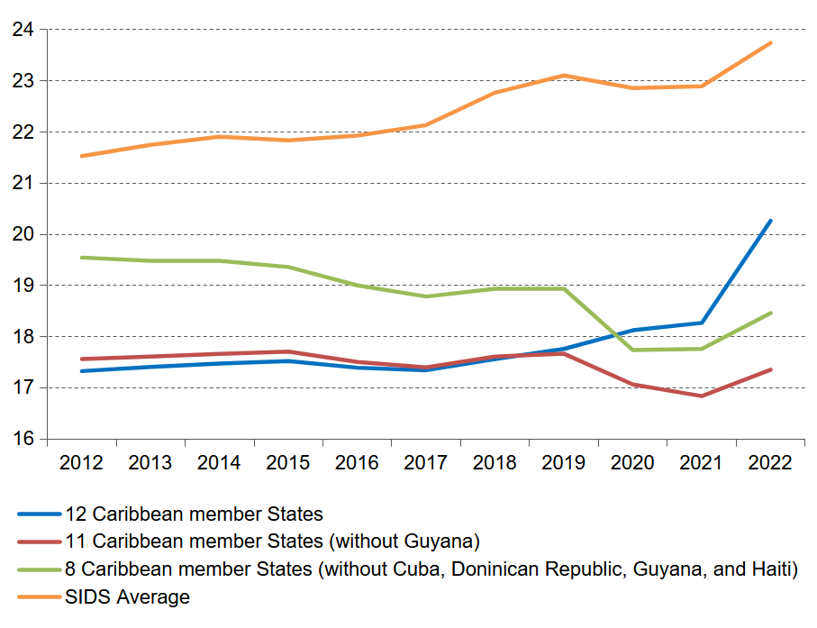
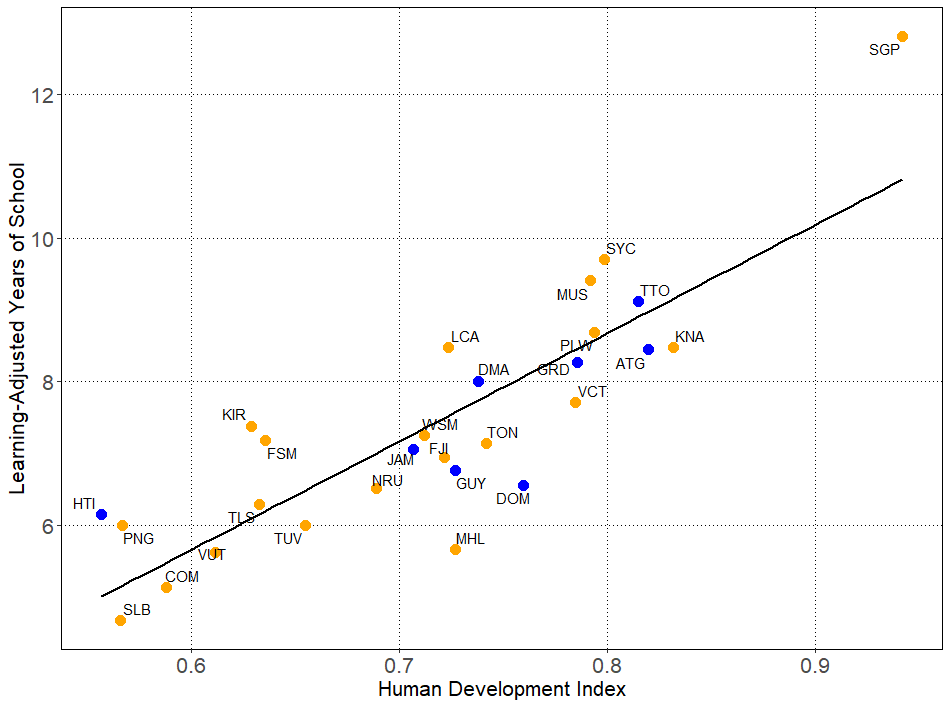
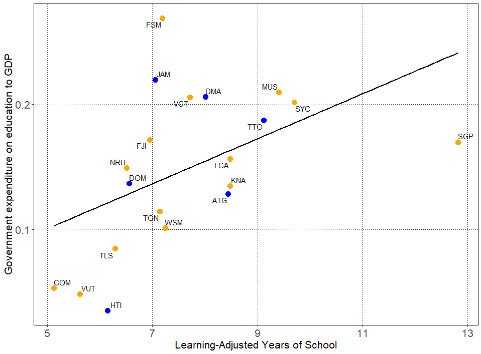

# Data Analysis | Statistics | International Development

### About me
Passionate about international development, I bring a diverse background spanning academia, 
the United Nations, and the private sector. With a Ph.D. in Global Studies and experience in international migration, 
economic development, and policy research, I specialize in qualitative and quantitative analysis, project management, and 
capacity-building initiatives.

At the United Nations ECLAC, I designed and implemented research projects advancing the 2030 Sustainable Development Goals,
focusing on socioeconomic and environmental statistics, labour markets, and migration. I also facilitated 
technical capacity-building workshops and multilateral meetings with Member State representatives. Before that, I published
peer-reviewed research on international political economy, migration, and regime stability in academia. Additionally, my 
freelance work included organizing international conferences, contributing to communications strategies for NGOs, and 
conducting field research on ecological risks and community knowledge creation.

My international experiences—having lived in Germany, the Caribbean, Venezuela, the United States, and Egypt and witnessing 
socioeconomic disparities firsthand—have shaped my commitment to global development. Fluent in five languages 
(English, German, Spanish, French, and Portuguese), I thrive in multicultural environments and bring high cultural and gender 
sensitivity to my work.

##  Projects

### Labour productivity, education financing and education outcomes in the Caribbean

Labour productivity is an important cornerstone of the modern economy. Increasing labour productivity is essential for countries to maintain economic growth, a crucial factor for achieving several sustainable development goals (SDGs), including eliminating poverty and hunger and promoting decent work (SDGs 1, 2, and 8). Unfortunately, available data show that labour productivity has declined or stagnated in most Caribbean countries in recent years. Arguably, deficiencies in the education system are a factor in the poor labour productivity of the subregion. These deficiencies, such as poor educational attainment and skills mismatch, result in poor quality of output, even as the number of school leavers and graduates increase, ultimately resulting in relatively low human capital, which hinders labour productivity in the Caribbean.

Labour productivity from 2012 to 2022 in 12 Caribbean member States was about four US$ lower than the SIDS average, as shown in figure 1. This trendline exhibits a stagnant trend at between 17 and 18 US$ from 2012 to 2019, after which it shows a steep upward slope, reaching 20.26 US$ in 2022. However, removing Guyana from the trendline of average labour productivity, containing 11 Caribbean member States, shows that this indicator stagnated throughout the analysed period at around 17 US$. Guyana is an outlier due to the massive oil windfalls accrued by this country in the late 2010s. As a result, the meteoric rise of its GDP in the recent past increases the indicator of output per hour worked, thus inflating its labour productivity levels.

#### Figure 1: Labour productivity growth

The trendline with eight Caribbean member States reveals a downward trend of labour productivity from 2012 to 2022 (Figure 1). This trendline excludes four Caribbeancountries; three countries with substantially larger populations compared to the other Caribbean countries (Cuba, Dominican Republic, and Haiti) and Guyana, an outlier due to extraordinary hydrocarbon windfalls. Average output per hour worked in these eight English- and Dutch-speaking Caribbean member States progressively fell from 19.5 US$ in 2012 to 18.9 US$ in 2019 (Figure 13). The COVID-19 pandemic adversely affected labour productivity, as expected, and output per hour worked further dropped to 17.7 US$ in 2020 and 2021, before recovering to 18.5 US$ in 2022. However, average output per hour worked in 2022 was one dollar less than one decade prior.

Orthodox human capital theory places the skills and knowledge imparted by educational institutions in adults, youth and children as a key driver of human capital (Becker, 993), and thus of labour productivity. The different industrial revolutions exemplify how productivity is driven by a labour force that can innovate complex technologies and effectively work with them to increase economic growth. Hence, education in the Caribbean is vital for economic development, social mobility, and individual empowerment (Wright, 2024). Although education is central to human capital formation, and thus to sustainable economic development, public financing for education in the Caribbean is not always optimal, creating deficiencies in educational outcomes. These deficiencies contribute to mismatches between educational outcomes and labour market needs, which adversely affect economic productivity in the subregion.
   
Educational outcomes are directly related to measures of sustainable development, such as labour productivity. Not surprisingly, the Human Development Index shows high correlation with the learning-adjusted years of school (average years of school weighted for the average harmonized test scores) for 25 SIDS, including 11 Caribbean member States for 2020 (Figure 2). This correlation is statistically significant (P-value < 0.001) and positive (R2 = 0.85), suggesting a strong relationship between education and human development. Yet, students in the subregion face significant challenges that hinder human capital formation and threaten progress on Goal 4 of the Sustainable Development Goals (SDGs), which aims for inclusive and equitable quality education for all. 

#### Figure 2: Correlation of Human Development Index and learning-adjusted years of school in SIDS, 2020

The impact of education onlabour productivity in the Caribbean is profound. Due to the importance of education as a key driver of human capital, public investments in education are essential to equip the workforce with the necessary skills, allowing them to contribute to overall productivity through their labour (Becker, 1993). This relationship is depicted in Figure 3, which correlates the average learning-adjusted years of school and government expenditure on education as a proportion of GDP, scaled for the population under 18 years of age in 25 SIDS for 2020. This correlation shows a moderately positively (R2 of 0.49) and statistically significant (P-value < 0.05) relationship between these variables. This relationship suggests that adequate public investments in education are essential for human capital accumulation.

#### Figure 3: Correlation of Learning-Adjusted Years of School and government expenditures on education to GDP (%) in SIDS, 2020, scaled for population under 18 years old

### How weak authoritarian petrostates survive economic crises

